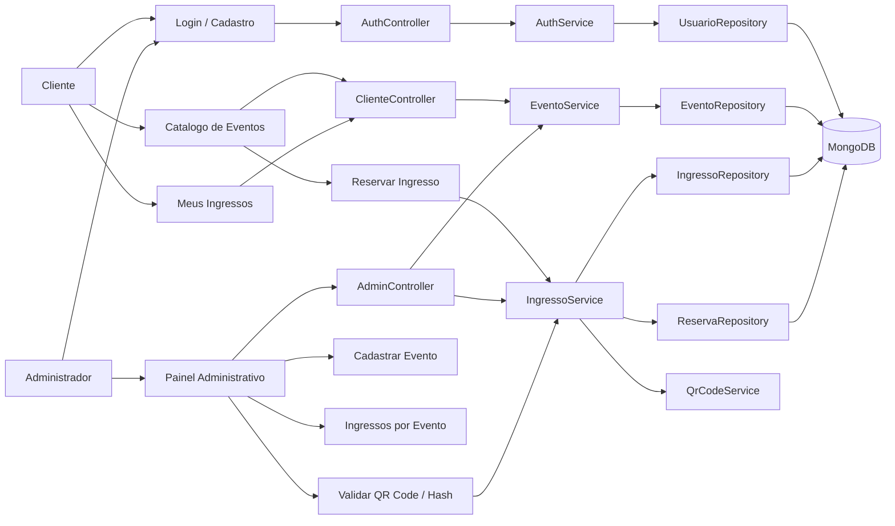
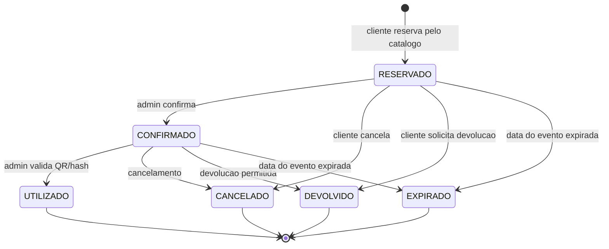
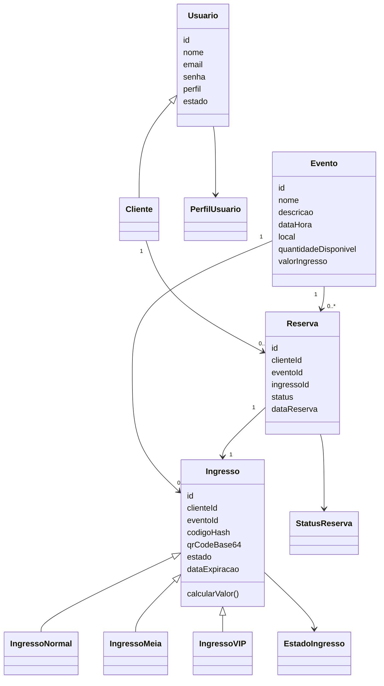

# Sistema de Gestao e Venda de Ingressos


## Sobre o Projeto

Este e um sistema web de gestao, reserva e venda de ingressos desenvolvido como atividade academica do bacharelado em Sistemas de Informacao da Universidade de Mogi das Cruzes (UMC).

O foco principal da aplicacao e demonstrar conceitos de Programacao Orientada a Objetos, como encapsulamento, heranca, polimorfismo, relacionamento entre objetos e separacao de responsabilidades, usando uma arquitetura em camadas com Spring Boot, Thymeleaf e MongoDB.

O projeto permite que clientes facam login, consultem um catalogo de eventos, reservem ingressos, acompanhem seus ingressos adquiridos e visualizem o QR Code de cada ingresso. Tambem possui um modulo administrativo para cadastro de eventos, consulta de ingressos emitidos por evento e validacao de entrada por hash/QR Code.

## Funcionalidades e Regras de Negocio

### Area do Cliente e Catalogo de Eventos

- Login e cadastro de clientes.
- Cadastro de administradores a partir da tela de login.
- Catalogo de eventos disponiveis.
- Exibicao de nome, descricao, data/hora, local, quantidade de ingressos disponiveis e valor do ingresso.
- Area do cliente em `/cliente/ingressos`.
- Consulta dos ingressos pertencentes ao cliente autenticado.
- Visualizacao do status do ingresso.
- Visualizacao do status da reserva vinculada ao ingresso.
- Visualizacao do hash e QR Code do ingresso.
- Botao para voltar ao catalogo em `/cliente/catalogo`.

### Modulo de Ingressos

- Reserva de ingressos feita pelo catalogo de eventos.
- Venda dinamica com diferentes tipos de ingresso:
  - `IngressoNormal`
  - `IngressoMeia`
  - `IngressoVIP`
- Calculo de valores usando polimorfismo:
  - Normal: valor integral.
  - Meia-Entrada: 50% do valor base.
  - VIP: valor base acrescido da taxa VIP.
- Persistencia dos diferentes tipos de ingresso na mesma collection do MongoDB.
- Controle de estados do ingresso, incluindo:
  - `DISPONIVEL`
  - `RESERVADO`
  - `PAGO`
  - `UTILIZADO`
  - `CANCELADO`
  - `DEVOLVIDO`
  - `EXPIRADO`

### Reserva de Ingressos

- Reserva de ingresso vinculada ao cliente autenticado.
- Validacao de disponibilidade antes da reserva.
- Bloqueio de reserva caso nao haja ingressos disponiveis.
- Bloqueio de duplicidade indevida de reserva ativa para o mesmo evento.
- Atualizacao automatica da quantidade de ingressos disponiveis.
- Criacao de uma reserva relacionando cliente, evento e ingresso.
- Geracao de identificador unico para cada ingresso.
- Acompanhamento do status da reserva na area do cliente.
- Reservas novas ficam com status `RESERVADA` e ingressos reservados ficam com estado `RESERVADO`.

### QR Code e Validacao Administrativa

- Cada ingresso recebe um hash unico gerado com SHA-256.
- Cada ingresso recebe um QR Code gerado com a biblioteca ZXing.
- O QR Code contem o hash do ingresso.
- O administrador pode validar um ingresso em `/admin/validar`.
- A validacao verifica se:
  - o ingresso existe;
  - o ingresso nao foi utilizado;
  - o ingresso nao foi cancelado;
  - o ingresso nao esta expirado.
- Apos validacao, o ingresso e marcado como `UTILIZADO`.
- O sistema impede o uso duplicado do mesmo ingresso.

### Modulo Administrativo

- Painel administrativo em `/admin`.
- Cadastro de novos eventos.
- Listagem dos eventos cadastrados.
- Consulta dos ingressos emitidos por evento.
- Confirmacao administrativa de ingressos reservados.
- Relatorios simples com quantidade de ingressos:
  - disponiveis;
  - reservados;
  - utilizados;
  - cancelados.
- Validacao de entrada por codigo hash/QR Code.

### Modulo de Seguranca

- Autenticacao com JSON Web Token.
- Token JWT com validade de 1 hora.
- Token armazenado em cookie HTTPOnly.
- Protecao de rotas com `HandlerInterceptor`.
- Bloqueio automatico da conta apos 3 tentativas falhas de login.
- Diferenciacao entre usuario cliente e usuario administrador por perfil.

### Cancelamento e Devolucao

- Cancelamento de ingressos.
- Devolucao de ingressos.
- Politica de devolucao baseada na data do evento.
- Reembolso permitido apenas quando o evento esta a pelo menos 7 dias de distancia.
- Atualizacao de estado do ingresso para `CANCELADO` ou `DEVOLVIDO`.

## Tecnologias Utilizadas

- **Backend:** Java 17, Spring Boot 3.2.3
- **Web:** Spring Web
- **Template Engine:** Thymeleaf
- **Banco de Dados:** MongoDB
- **Persistencia:** Spring Data MongoDB
- **Seguranca:** JWT com biblioteca JJWT
- **QR Code:** ZXing
- **Frontend:** HTML5, CSS3 e Bootstrap 5 via CDN
- **Build:** Maven
- **IDE:** IntelliJ IDEA

## Arquitetura e Modelagem

O projeto segue a arquitetura MVC com separacao em camadas:

```text
Controller -> Service -> Repository -> MongoDB
```

### Diagrama Atualizado do Sistema



### Ciclo de Vida do Ingresso



### Relacionamento Entre Classes Principais



### Camada Model

Contem as classes de dominio do sistema:

- `Usuario`
- `Cliente`
- `Evento`
- `Reserva`
- `Ingresso`
- `IngressoNormal`
- `IngressoMeia`
- `IngressoVIP`
- `EstadoIngresso`
- `EstadoUsuario`
- `PerfilUsuario`
- `StatusReserva`
- `PoliticaDevolucao`

### Camada Repository

Responsavel pela comunicacao com o MongoDB usando `MongoRepository`:

- `UsuarioRepository`
- `EventoRepository`
- `IngressoRepository`
- `ReservaRepository`

### Camada Service

Centraliza as regras de negocio:

- `AuthService`
- `EventoService`
- `IngressoService`
- `QrCodeService`

### Camada Controller

Controla as rotas HTTP e integra as telas com as regras de negocio:

- `AuthController`
- `ClienteController`
- `IngressoController`
- `AdminController`

## Rotas Principais

| Rota | Descricao |
| --- | --- |
| `/login` | Tela de login |
| `/cadastro` | Cadastro de cliente |
| `/cadastroAdmin` | Cadastro de administrador |
| `/cliente/catalogo` | Catalogo de eventos |
| `/cliente/ingressos` | Ingressos do cliente autenticado |
| `/admin` | Painel administrativo |
| `/admin/validar` | Validacao de ingresso por hash/QR Code |
| `/admin/eventos/{id}/ingressos` | Ingressos emitidos por evento |

## Como Executar o Projeto Localmente

### Pre-requisitos

- Java 17 ou superior instalado.
- Maven instalado ou Maven integrado ao IntelliJ.
- MongoDB rodando localmente na porta padrao `27017`.

### Passo a Passo

1. Baixe e extraia o arquivo `Sistema_de_Ingressos_atualizado.zip`.

2. Abra a pasta do projeto no IntelliJ IDEA.

3. Aguarde o Maven baixar as dependencias.

4. Confira se o MongoDB esta rodando localmente.

5. Execute a classe principal:

```text
com.Jonathas.Main
```

6. Acesse no navegador:

```text
http://localhost:8080
```

## Configuracao do MongoDB

O sistema usa o banco `sistema_ingressos`:

```properties
spring.data.mongodb.uri=mongodb://localhost:27017/sistema_ingressos
```

## Usuario Administrador Inicial

Na primeira execucao, o sistema cria automaticamente um usuario administrador caso ele ainda nao exista:

```text
Email: admin@umc.br
Senha: 123456
```

Tambem sao criados eventos iniciais para facilitar os testes do catalogo.

Se o banco ja possuir um usuario `admin@umc.br` criado em uma versao antiga, o sistema atualiza esse usuario automaticamente para o perfil `ADMIN`.

## Observacoes Tecnicas

- O hash do ingresso e gerado com SHA-256 usando dados relevantes do cliente, evento, data/hora e UUID.
- O QR Code e gerado em PNG e armazenado em Base64.
- O ingresso possui data de expiracao baseada na data do evento.
- A validacao administrativa marca o ingresso como utilizado e impede reutilizacao.
- O sistema preserva cancelamento e devolucao de ingressos, mas a criacao de ingressos ocorre pelo catalogo de eventos e reservas.

## Desenvolvedor

Desenvolvido por **Jonathas Eduardo Santos Ramos**

Estudante de Sistemas de Informacao - 7º Semestre

Universidade de Mogi das Cruzes (UMC)
